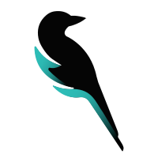

<div width="250px">


# Magpie-Twitch

The goal of this project is to create a suite of tools anyone can host themselves to improve their streaming experience. Users will have access to built in commands and widgets that can all be used on twitch and tools such as OBS.

</div>
<br />

## Directory Structure

| File Name          | Description                     |
| ------------------ | ------------------------------- |
| [Front](Front)     | Frontend for setup and config   |
| [ChatBot](ChatBot) | Basic chat bot functionallity   |
| [Widgets](Widgets) | Serves widgets via links        |
| [API](API)         | API to handle incoming requests |

## Getting Setup

This project uses Yarn 3 which requires some extra work depending on the editor you prefer:

### vscode

1. `yarn sdks vscode`
2. `"typescript.tsdk": ".yarn/sdks/typescript/lib"`

## Docker

This project is designed to be run using docker. While it is possible to run using inline cmds certain things such as env files will not be loaded and the functionallity will break.

### Commands

Runs dev containers

```
docker-compose -f docker-compose.yml -f docker-compose-dev.yml up -d --build
```

Shut down dev containers

```
docker-compose -f docker-compose.yml -f docker-compose-dev.yml down --rmi all
```
