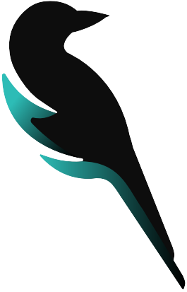

<div style="margin: 0 auto; max-width: 750px;">

<div style="height:1px"></div>

# Magpie-Twitch

The goal of this project is to create a suite of tools anyone can host themselves to improve their streaming experience. Users will have access to built in commands and widgets that can all be used on twitch and tools such as OBS.

---

</div>

<div style="clear: both">

## Directory Structure

| File Name          | Description                   |
| ------------------ | ----------------------------- |
| [ChatBot](ChatBot) | Basic chat bot functionallity |
| [API](API)         | API to handle twitch requests |

## Docker

This project is designed to be run using docker. While it is possible to run using inline cmds certain things such as env files will not be loaded and the functionallity will break.

### Commands

Runs dev containers

```
docker-compose -f docker-compose.yml -f docker-compose-dev.yml up -d --build
```

Shut down dev containers

```
docker-compose -f docker-compose.yml -f docker-compose-dev.yml down --rmi all
```
